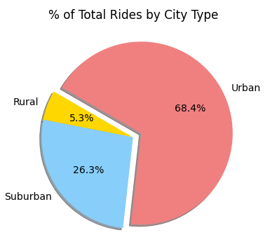
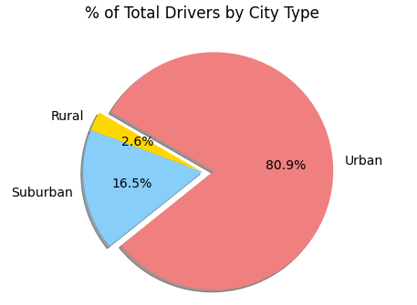
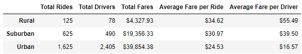
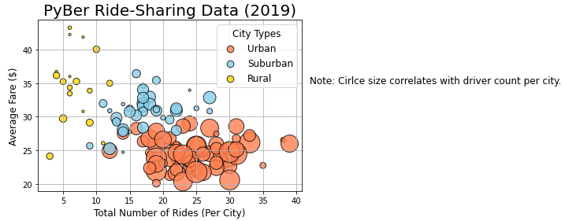
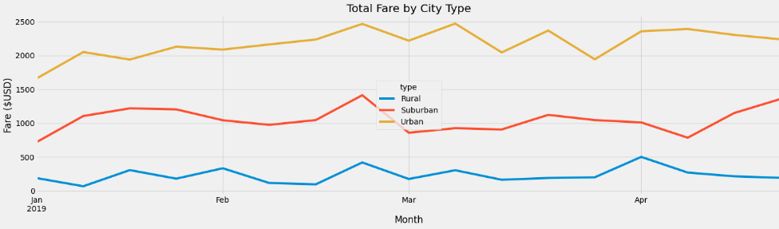

# Pyber_Analysis

## Background

The PyBer company needs the 2019 ride-share data analyzed in order to determine the average weekly fares for each city type. The purpose of this analysis is to help Pyber improve the access of their ride-share company as well as to determine the affordability of these services to underserved neighborhoods. In order to perform this analysis, the following information for each city type was gathered:

-	The total number of rides for each city type
-	The total number of drivers for each city type
-	The sum of the fares for each city type
-	The average fare per ride for each city type
-	The average fare per rider for each city type

# Resources
Data Sources: 
city_data.csv
ride_data.csv

Software: 
Python 3.7.6
Jupyter Notebook 6.4.8
Ipykernel 6.9.1
Anaconda 4.13.0

## Results

The analysis of the PyBer 2019 ride-share data showed that the majority of ride-share occurs within the urban city type. The urban neighborhoods make up more than two-thirds (68.4%) of the total rides by city type. Suburban areas account for almost a third of the total at 26.3% while the rural areas account for only a fraction of that, with a mere 5.3% of the total rides by city type. 

It is expected that the urban area would have the highest percentage of total rides due to the high population of urban areas in comparison to the other city types. To further understand what may be causing the large difference in the number of rides for each city type, the number of drivers per city type was analyzed. This data showed that there are significantly more drivers within the urban areas than in both the suburban and rural areas combined. The urban cities account for 80.9% of the total drivers for PyBer. Similar to total rides, suburban areas come second with 16.5%, and the rural areas only makeup 2.6% of all PyBer drivers. 

The data was then further collected by city type to produce a summary table in order to visualize the overall data. Urban cities not only had a higher number of total rides and total drivers, but they also made significantly more money overall. Though urban cities’ total fares are much higher, their average fare per ride ($24.53) and average fare per driver ($16.57) is lower than both the suburban and rural cities as shown below. 

A bubble chart was produced in order to show a visual representation of the relationship between the average fare and the total number of rides per city type: 

The PyBer dataframe was resampled by date in order to produce a line chart of the total fare by city type by date.  From this chart, a visual representation of the month by month total fares for each city type where the peaks and dips represent different weeks.

## Summary

After reviewing all of the analyzed data and charts there are a few thing that PyBer can do to provide better accessibility and affordability to underserved areas.
1)	First and foremost, the cost of ride-share in rural areas is exceptionally high. The highest-earning city type, urban cities, charge an average of $16.57 per driver and an average of $24.53 per ride. Compare this to the $55.49 average fare per driver and $34.62 average fare per ride, rural cities cost significantly more. In order to increase the number of people willing to ride-share, the cost of rides is recommended to be lowered for rural cities.
2)	There is a lack of drivers within the rural cities, making availability even more scarce. Considering there are fewer drivers available within rural cities, each driver can charge more money for their services due to the lack of competition. An increase in the number of drivers for the rural areas may increase the number of ride-shares within these neighborhoods. However, this is something that would need further demographic information in order to properly execute. If the population does not provide enough demand for ride-share, it would be difficult to increase the number of drivers, but if the travel distances are further then this may still benefit these areas. 
3)	PyBer could also run a promotion during the peak weeks or slower weeks to increase the number of ride-shares within those areas. By looking at the line graph for the Total Fare by City Type, PyBer can assess the trends of ride-share within each city type. By providing promotions during busy weeks, more people may be willing to ride-share as opposed to other transport methods when travel is heavier. If the promotion is ran through the slower weeks, people who normally live in the surrounding areas may be more willing to pay for ride-share. To get a better idea of which approach would be more beneficial, a further study should be performed in order to determine the cause of the peaks and dips within each city type; i.e. holidays, concerts, events, etc.
